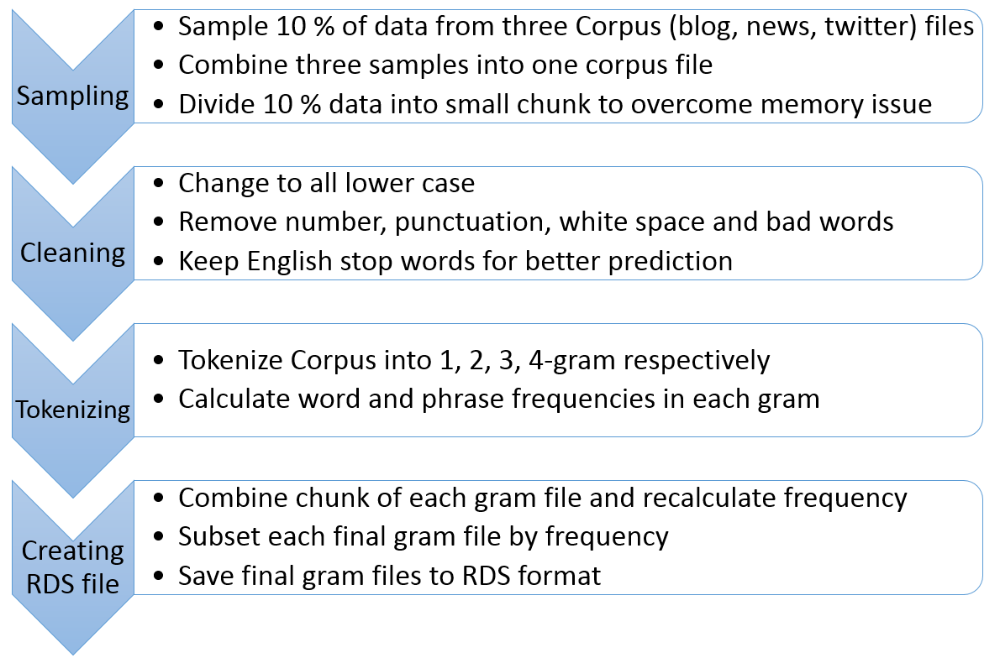
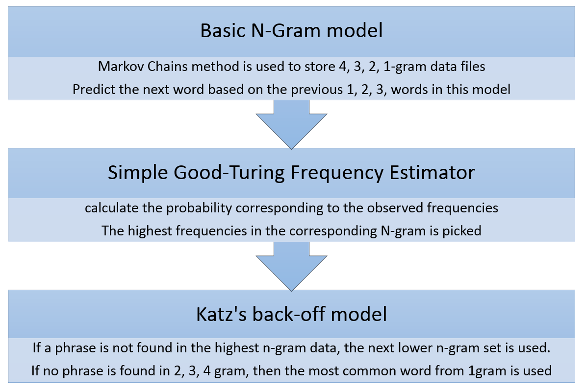
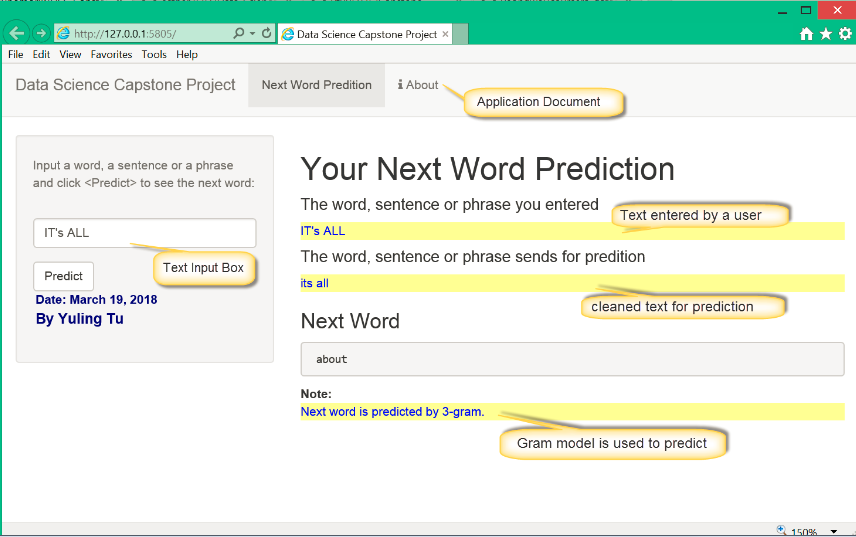

Capstone Project: Text Predition Shiny Application
========================================================
author: Yuling Tu
date: March 19, 2018
transition: concave
autosize: true

## The Capstone project is cooperated among three partners.   
![Coursera] (allpartners.png) 

========================================================

# Project Overview

- This is the final project from Cousera Data Science Specialization.

- A Shiny application (Next Word Predition) that has widget input,  reactive output using server calculations, and supporting documentation.

- A Reproducible Pitch Presentation that contains five slides in R Presentation to present the shiny application.  

- The data set is provided by Swiftkey.

[Project Data Set] (https://d396qusza40orc.cloudfront.net/dsscapstone/dataset/Coursera-SwiftKey.zip)

==============================================================

# Data Preparation 

========================================================

# Prediction Model

========================================================
# Application Demo
 
 
