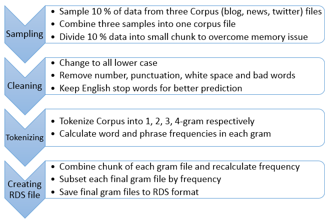
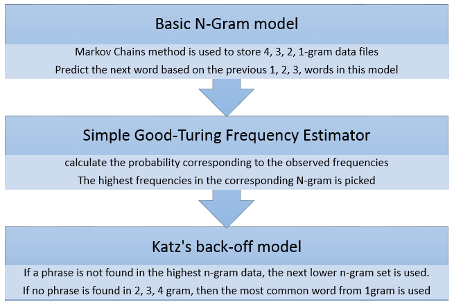
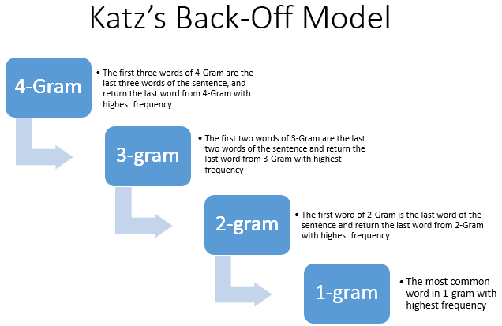

# Overview

This project is sponsored by the following partners.


The project uses three corpus files provided by SwiftKey and use multiple R text mining packages to predict the next word.  

The final project use Shiny package to get user's input, send to server to run through Katz's back-off prediction, and then return the next word prediction. 

Special thanks to SwiftKey for providing the Corpus data for this course project. 

# Data Preparation

The first step of creating data application is to clean and explore the data. In fact, data preparation is the most time consume part in this project. I believe it's the same for most of data project.  

However, due to R process configuration, all the data and codes are loading into memory. Separating raw data into small chunks and combining processed data into final files are required to prepare the RDS files.

The following flow describe the data preparation flow. 




The bad words are removed during data preparation.  Special thanks to this Github contributor. The English bad words are downloaded from this site.  

[English Bad Word Link](https://github.com/LDNOOBW/List-of-Dirty-Naughty-Obscene-and-Otherwise-Bad-Words/blob/master/en)


# Predition Model

The prediction model is designed as indicated below.




Katz's back-off model is the main prediction process.  The following flow chart describes the detail of the model.




## Appdenix

The following charts display the most common words and phrases from 1, 2, 3, 4-gram RDS files. 

                                                  Top 50 Unigrams

```{r, echo=FALSE, message=FALSE, warning=FALSE,fig.width=12, fig.height=8}
suppressWarnings(library(ggplot2))
suppressWarnings(library(wordcloud))
suppressWarnings(library(RColorBrewer))

# load 4 n-gram rds
gram1 <- readRDS(file="gram1.rds")
gram2 <- readRDS(file="gram2.rds")
gram3 <- readRDS(file="gram3.rds") 
gram4 <- readRDS(file="gram4.rds")

## workcloud for 1-gram
wordcloud(gram1$word, gram1$freq, max.words=50, random.order=FALSE, rot.per=0.25, 
          colors=brewer.pal(8, "Dark2"))
```

                                                  Top 25 Bigrams

```{r, echo=FALSE, fig.width=10, fig.height=6}
## workcloud for 2-gram
wordcloud(gram2$word, gram2$freq, max.words=25, random.order=FALSE, rot.per=0.25, 
          colors=brewer.pal(8, "Dark2"), main="Top 25 Bigrams")

##ggplot for 3-gram
ggplot(gram3[1:25,], aes(reorder(word,-freq), freq))  +
    labs(x = "Trigrams", y = "Frequency") +
    ggtitle("Top 25 Trigrams") +
    theme(plot.title = element_text(hjust = 0.5, size = 22)) +
    geom_bar(stat = "identity", fill = "lightblue") +
    theme(axis.text.x = element_text(angle = 45, size = 14, hjust = 1))

##ggplot for 4-gram
ggplot(gram4[1:25,], aes(reorder(word,-freq), freq))  +
    labs(x = "Quadgrams", y = "Frequency") +
    ggtitle("Top 25 Quadgrams") +
    theme(plot.title = element_text(hjust = 0.5, size = 22)) +
    geom_bar(stat = "identity", fill = "lightblue") +
    theme(axis.text.x = element_text(angle = 45, size = 14, hjust = 1)) 
```
